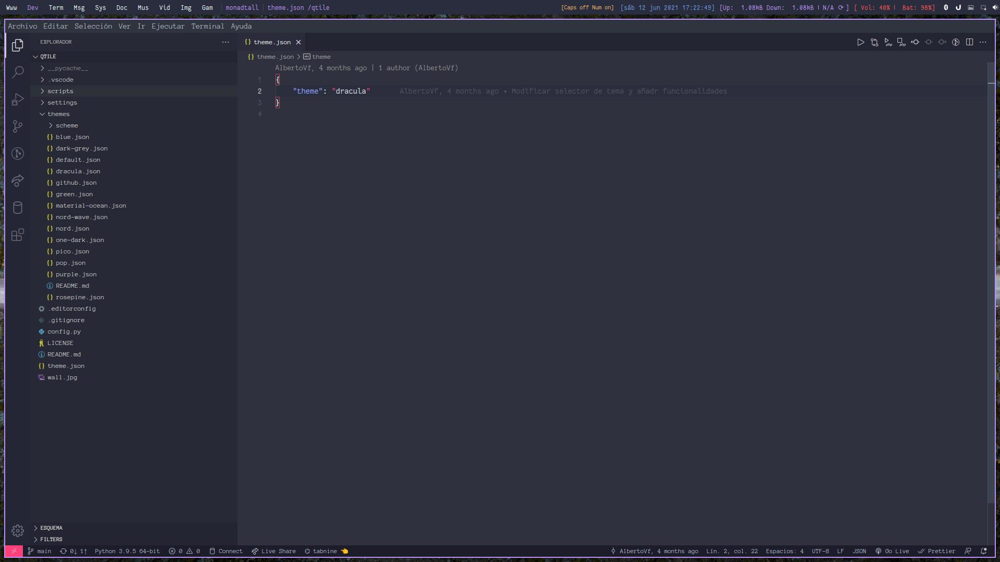

# Arco Qtile

Configuracion personalizada para QTile en ArcoLinux.



## Personalizacion de thema

1. Agregar a __themes__ un fichero json con el esquema de colores ([Configuracion de colores](themes/README.md))
2. Modificar el archivo __theme.json__ y substituir el valor de la propiedad **theme**.
3. Reiniciar Qtile para aplicar los cambios.

## Instalacion

```bash
git clone https://github.com/AlbertoVf/qtile ~/.config/qtile
```
