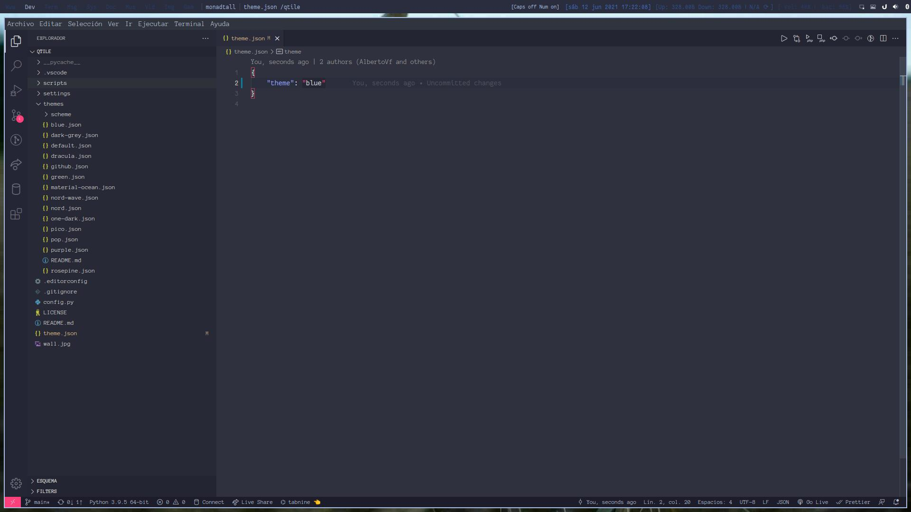
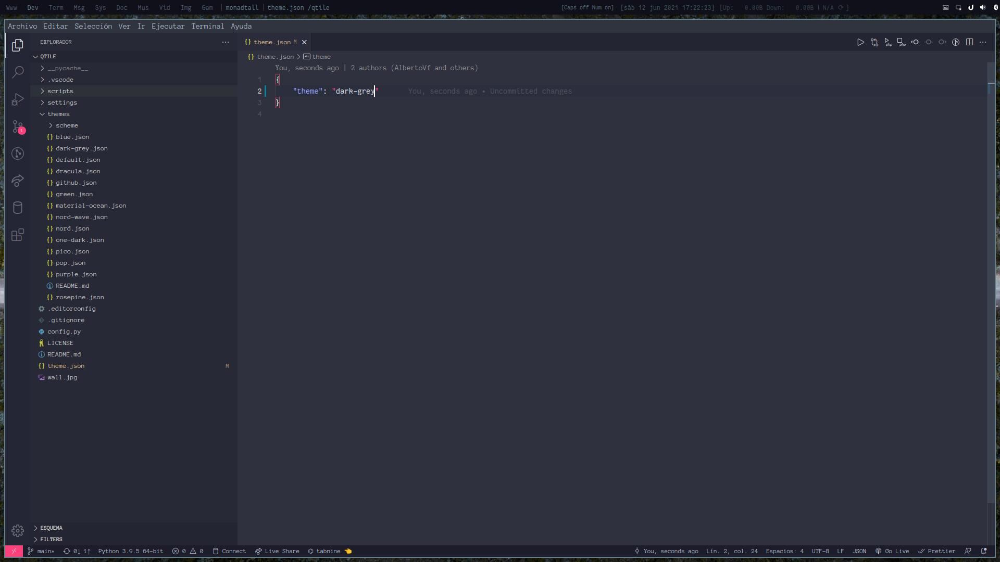
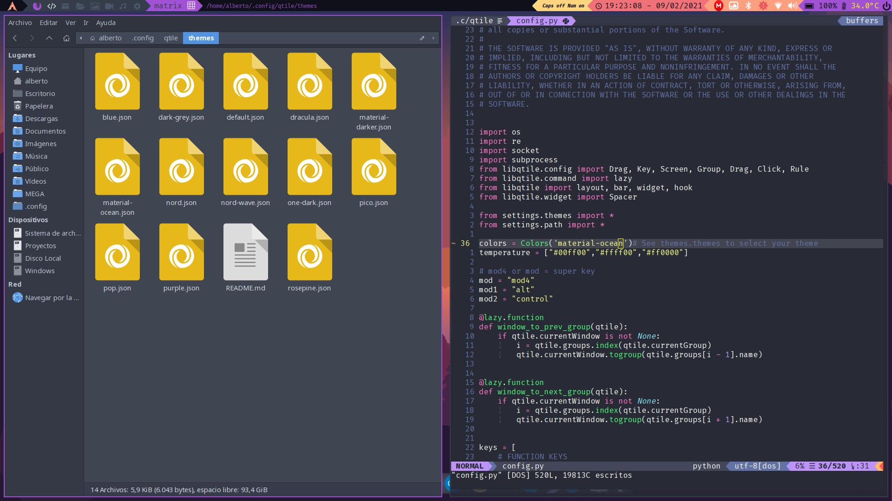
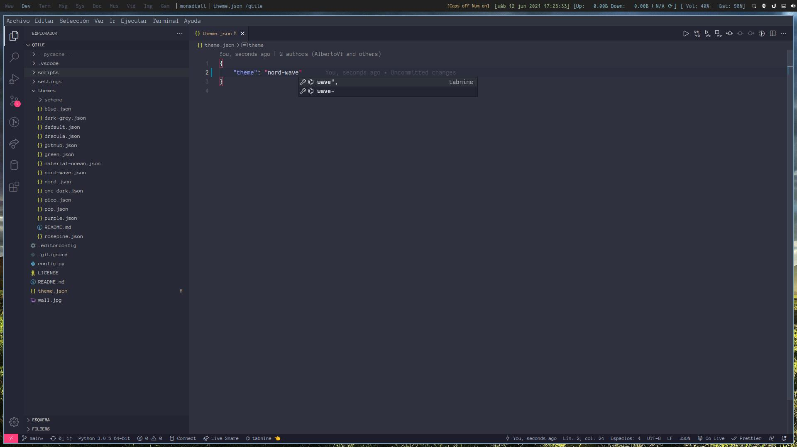
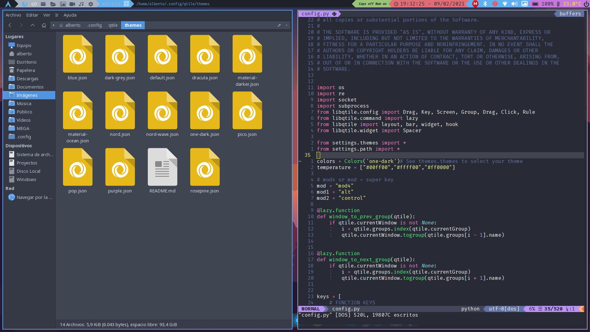

# Configuracion de nuevo tema

1. Crear un fichero __json__ con el nombre del tema.
2. Copiar la siguiente estructura y añadir los valores.


```json

{
  "nombre_tema":[
    {
      "dark":"",
      "grey":"",
      "light":"",
      "text":"",
      "focus":"",
      "active":"",
      "inactive":"",
      "urgent":"",
      "color1":"",
      "color2":"",
      "color3":"",
      "color4":""
    }
  ]
}

```

## Vista previa
### blue


### dark grey


### default


### dracula


### material darker


### material ocean


### nord wave


### nord


### one dark


### pico


### pop


### purple


### rosepine

